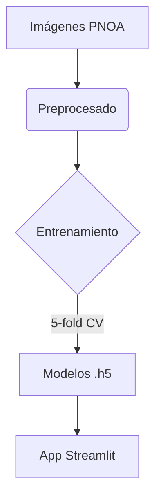

# 🌿 GreenMask: Detección de Zonas Verdes Urbanas

**GreenMask** es un Proyecto Demo que combina datos satelitales libres del [Plan Nacional de Ortofotografía Aérea (PNOA)](https://pnoa.ign.es/) a **0.25 metros por pixel**, validados con [OpenStreetMap](openstreetmap.org/) y datos oficiales del Ayuntamiento de Valencia ([Espais Verds](https://valencia.opendatasoft.com/explore/dataset/espais-verds-espacios-verdes/table/?flg=es-es)).

Se hace uso de [MobileNetV2 ](https://arxiv.org/pdf/1801.04381) una arquitectura ligera sobre la que se construye un modelo **U-Net** para segmentar áreas verdes en entornos urbanos.
Este proyecto recorre todas las fases clave de un flujo geoespacial desde la extracción de datos para crear un pequeño dataset, el preprocesado del mismo, y el entrenamiento con validación cruzada. 

Finalmente realizamos el despliegue de una aplicación interactiva en [Streamlit](https://streamlit.io/). 


## 🚀 Resumen del Flujo

1. **Extracción de datos**
   - Descarga de ortofotos PNOA (IGN) en mosaico dinámico usando **teselas WMTS**.
   - Obtención de geometrías de parques de OSM y datos oficiales del Ayuntamiento de Valencia.
   - Conversión coordenadas: **WGS84 (EPSG:4326) ↔ UTM (EPSG:25830)**.

2. **Generación de máscaras**
   - Rasterizado de polígonos verdes para cada parche (GeoTIFF) con **transformaciones afines**.
   - Cálculo de índices (ExG (seudo NDVI) y previsualización interactiva
3. **Entrenamiento**
   - U-Net con backbone MobileNetV2 (TensorFlow).
   - Validación cruzada (K-fold) y combinando perdida Dice+BCE.
4. **Evaluación**
   - Métricas globales (Precision, Recall, F1, IoU).
   - Exploración de umbrales y muestras comparativas.
5. **Demo interactiva**
   - Streamlit + Leafmap: mapa clicable con selección de parches.
   - Visualización satélite + máscara IA + métricas en tiempo real.

El dataset está centrado en la ciudad de Valencia. Puedes clonar el proyecto ejecutando:
```bash
git clone https://github.com/luccifer00/GreenMask.git
cd GreenMask
pip install -r requirements.txt
streamlit run app/app.py
```


## 📂 Estructura del Proyecto

```
GreenMask/
├── app/                  # App de Streamlit
│   └── app.py
├── notebooks/           # Exploración y entrenamiento
├── scripts/             # Utilidades (config, model_utils…)
├── data/                # Imágenes y máscaras
├── models/              # Modelos U‑Net (.h5)
├── README.md            # Documentación
└── requirements.txt     # Dependencias
```

---

## 🛠️ Tecnologías
```python
["TensorFlow", "Streamlit", "Folium", "GeoPandas", "Rasterio", "Mercantile", "Earth Engine API", "OpenStreetMap"]

```

---

## 🚀 Pipeline de Entrenamiento


## 🚀 Pipeline de Entrenamiento

```mermaid
flowchart TD
    A([🛰️ Imágenes PNOA]) --> B([⚙️ Preprocesado])
    B --> C{{🏋️ Entrenamiento}}
    C -->|5‑fold CV| D([📦 Modelos .h5])
    D --> E([🌍 App Streamlit])


Desarrollado por **Fernando G.** en Abril 2025 motivado por **[Green Urban Data](https://greenurbandata.com/)**.

